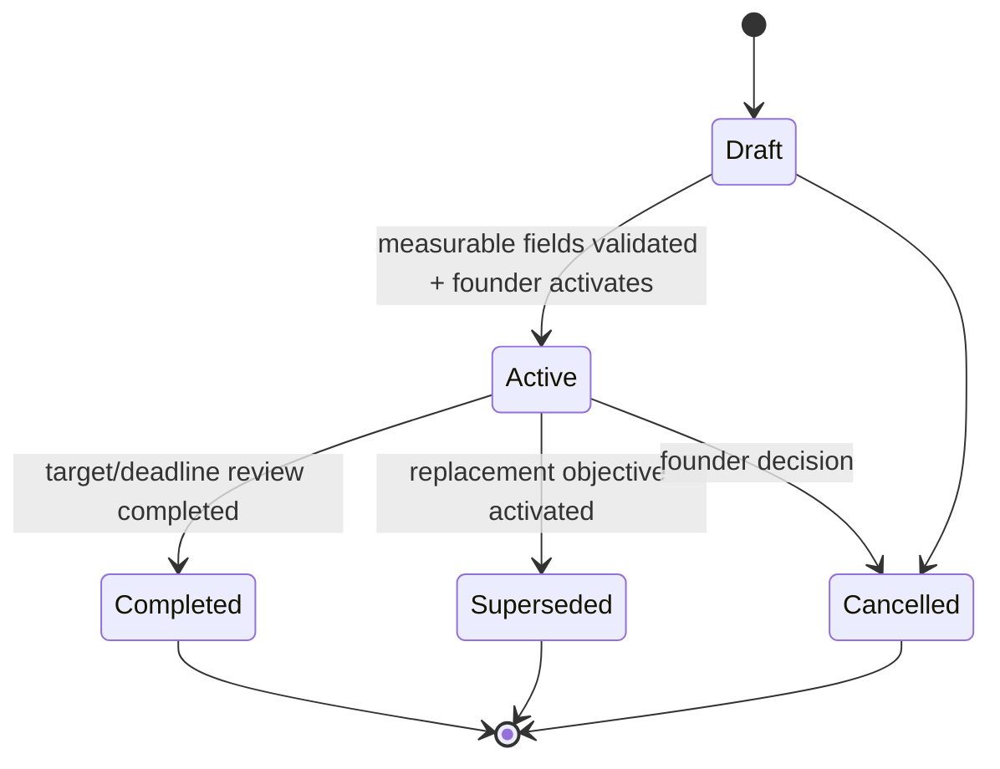
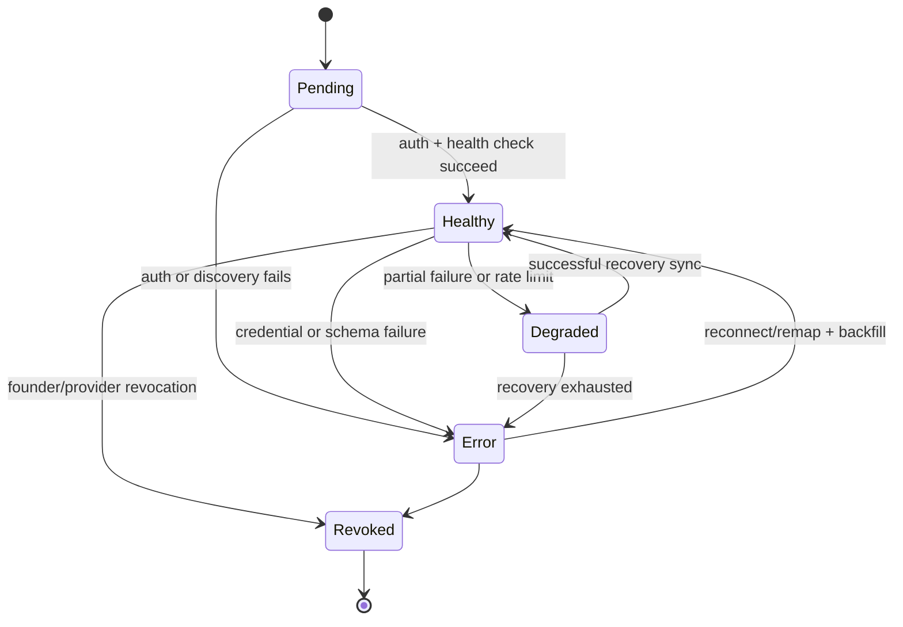
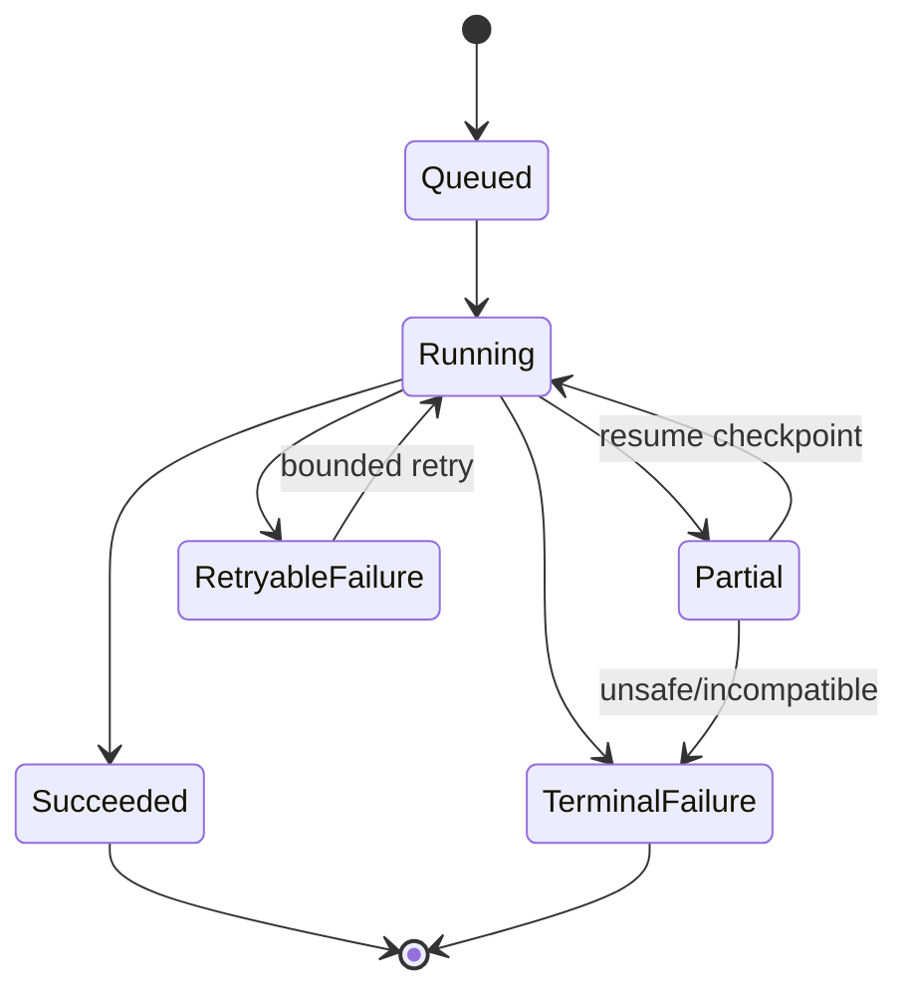
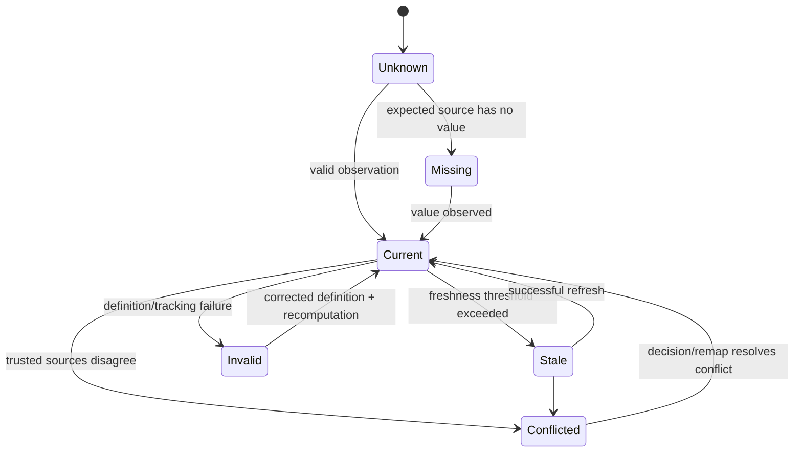
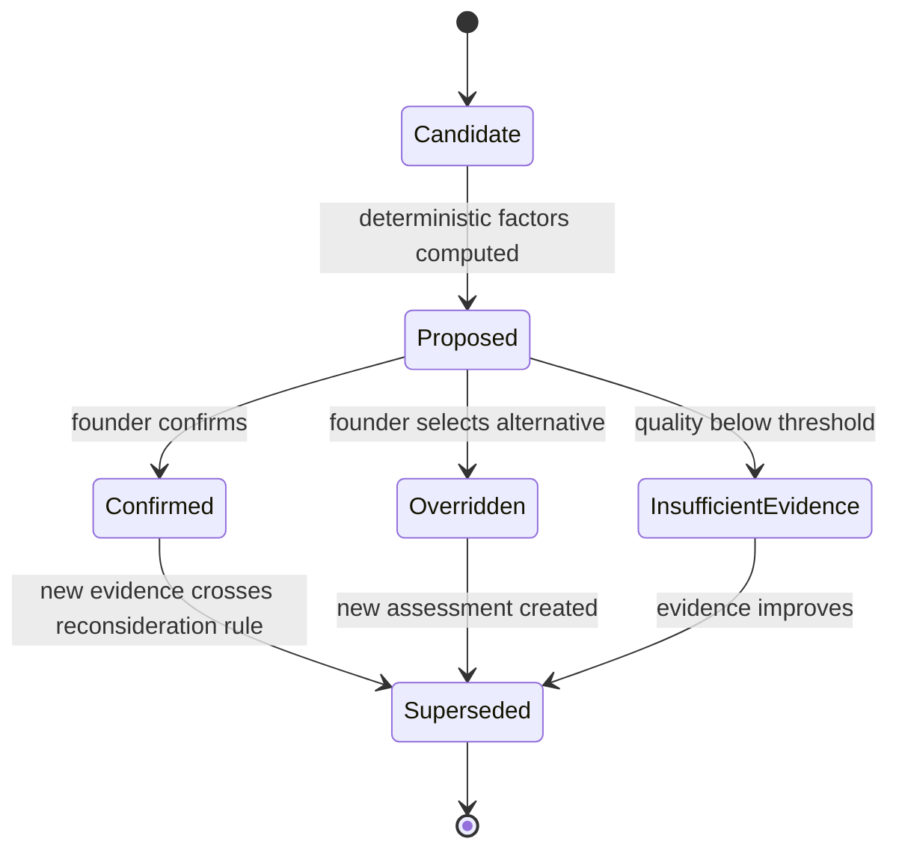
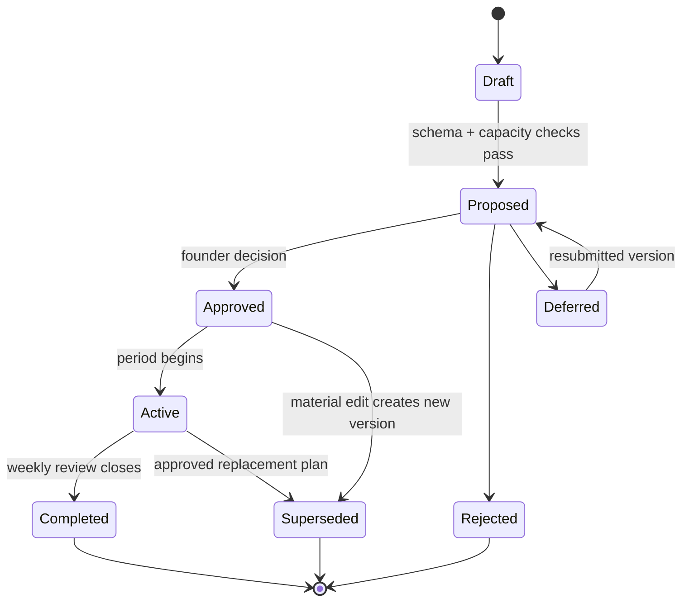
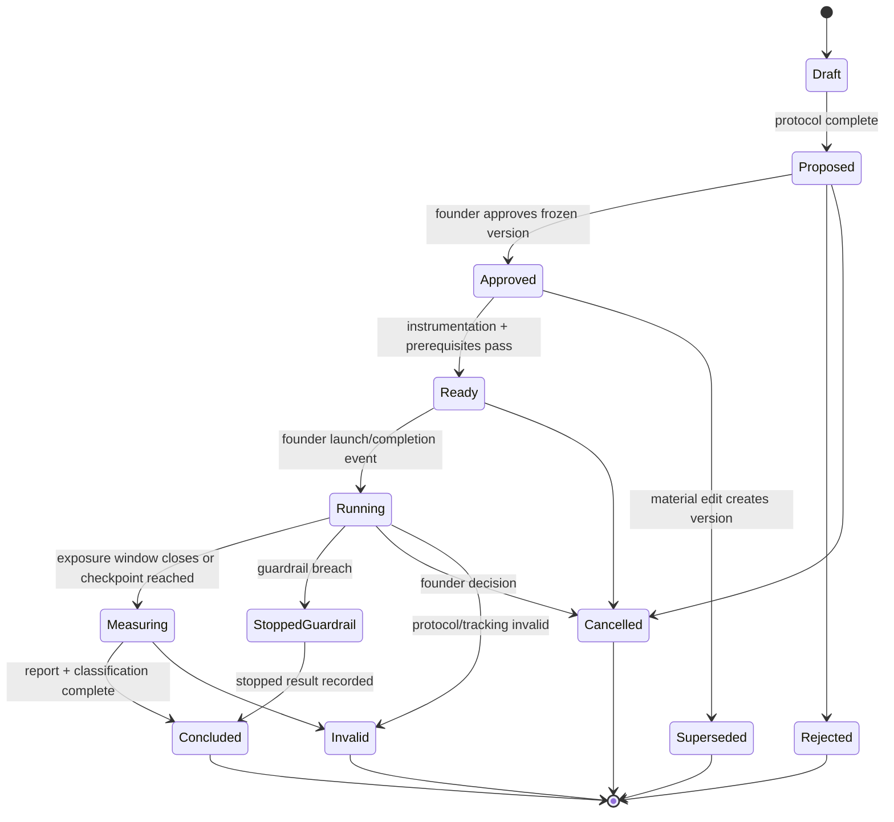
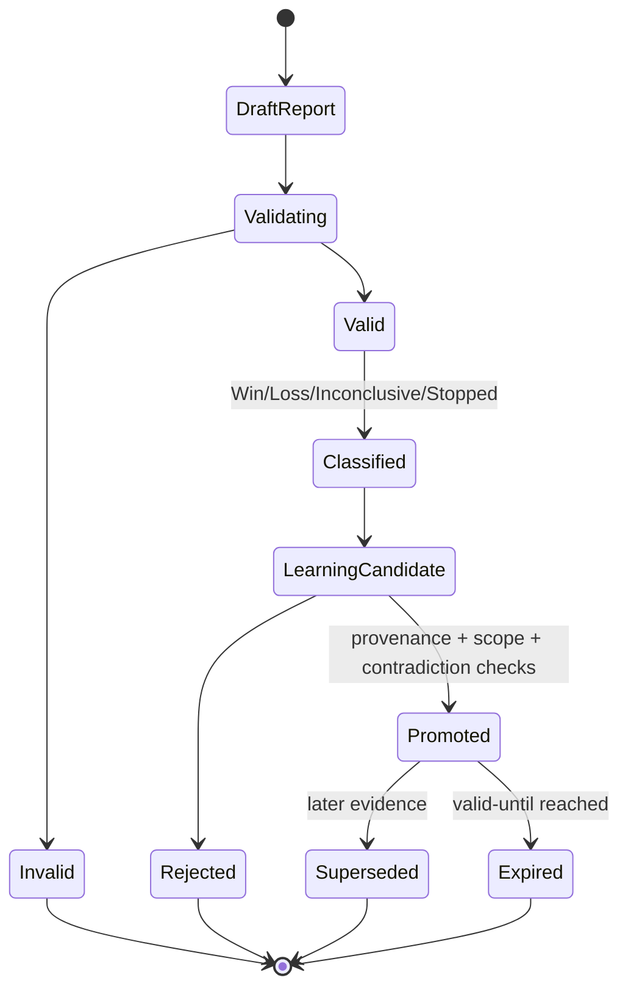
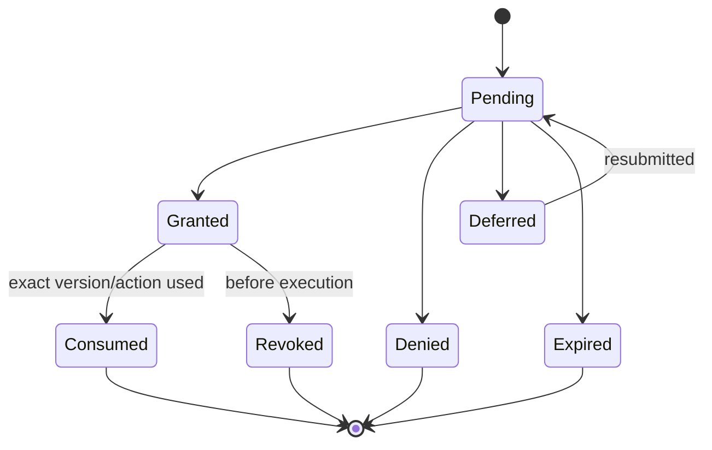
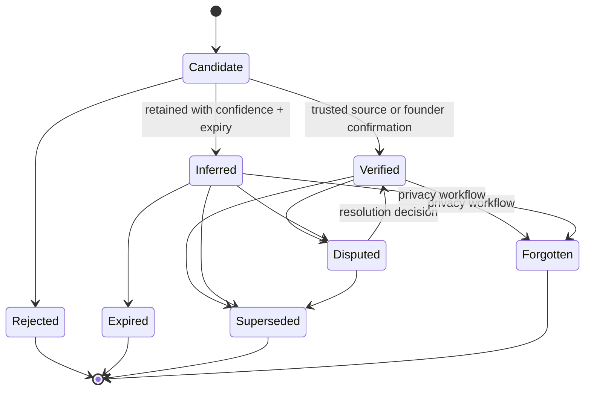

# State-transition diagrams

**Status:** Proposed domain contract. Illegal transitions fail closed and emit an audit event. All material post-approval edits create a new version.

## Objective

Invariant: a partial unique constraint permits only one `Active` objective per workspace.

## Connection and sync

## Metric quality

`0` is a value in `Current`, not a quality state.

## Constraint assessment

An insufficient assessment names measurement/instrumentation or customer understanding as the constraint; it never fabricates a funnel conclusion.

## Plan

## Experiment lifecycle

Start guard: approved immutable protocol, instrumentation readiness, owner, start/duration/review date, primary metric, guardrails, minimum evidence, and decision rule.

## Measurement and learning

Only a `Valid` measurement report can create a promotable learning. `Invalid` is an experiment result state, not a durable strategic learning.

## Approval request

In V1, approval cannot make a Class D–F action executable; the global V1 policy still blocks it.

## Memory item

Contradictory items coexist and link to one another until a decision resolves them; history is not silently overwritten.

