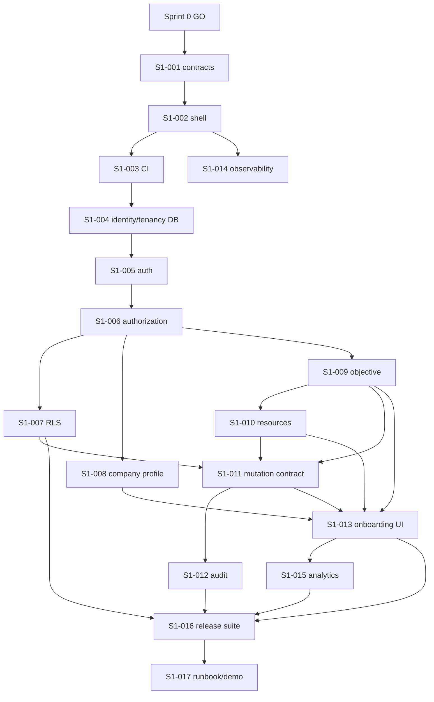

# Sprint 1 plan — secure workspace foundation

**Status:** Conditional draft; reviewable but not authorized for implementation  
**Sprint length:** Two weeks  
**Baseline staffing:** Two engineers plus founder/product input; approximately 17.5 ideal engineering days, leaving about 2.5 engineer-days for review and defects  
**Feature outcome:** A founder can create a private workspace and define the company’s measurable growth objective and operating constraints.

## Entry gate

Sprint 1 starts only after a recorded Sprint 0 `go` decision confirms:

- at least five founders completed two concierge loops;
- at least three launched an experiment;
- repeated use was requested;
- the first connector and most valuable prepared artifact are known;
- canonical glossary, state transitions, V1 action policy, and initial eval fixtures are reviewed;
- the founder/product owner accepts or revises ADR-002 for database/auth hosting.

If the decision is `iterate`, only planning refinements and additional concierge work proceed. If `stop`, this plan is archived without implementation.

## Sprint exit gate

- Two seeded workspaces cannot read or mutate each other’s records through UI, API, repository, background service identity, or direct authenticated database access.
- Every successful and denied mutation is attributable to actor, workspace, request, target, and time.
- An objective cannot become active without metric, target, deadline, segment, and rationale; an unknown baseline is permitted and remains distinct from zero.
- Company profile, objective, and resource constraint histories are versioned.
- The founder can complete the Sprint 1 onboarding slice and resume safely after validation errors.
- Required analytics and baseline observability are visible.
- No application path performs external communication, account/product mutation, spending, or data deletion.

## User-visible demo story

1. Founder A signs in, creates Workspace A, records a measurable objective, founder hours, cash limit, risk level, prohibited tactics, and brand constraints.
2. Founder A edits the objective; the old version and audit trail remain inspectable.
3. Founder B creates Workspace B.
4. Automated and manual attempts by Founder B to read or mutate Workspace A fail with a non-revealing authorization response and an audit event.
5. Support trace lookup reconstructs Founder A’s setup without exposing credentials or cross-tenant data.

## Roles

| Role | Responsibility |
|---|---|
| Founder/product lead | Gate decision, field language, validation rules, demo acceptance |
| Engineer A — platform/domain | environments, database, auth, tenancy, audit, migrations |
| Engineer B — product/full stack | domain services, onboarding UI, analytics, end-to-end scenarios |
| Security reviewer | RLS/authorization threat review; may be Engineer A with explicit peer review |
| Design reviewer | onboarding clarity/accessibility review; may be founder/product for private beta |

## Ticket plan

Estimates are ideal engineering days. `CP` marks the critical path.

### S1-001 — Ratify Sprint 1 contracts and threat model (`CP`, 0.5 day)

- **Owner:** Founder/product + Engineer A
- **Depends on:** Sprint 0 go record; proposed ADR-002; glossary and state contracts
- **Work:** Freeze the Sprint 1 field glossary, roles, tenant boundary, active-objective invariant, audit envelope, error vocabulary, and V1 deny policy. Record accepted deviations from the planning package.
- **Acceptance:** Review record names the exact contracts and versions used by every later ticket; unresolved security decisions have owners and due dates.
- **Analytics/observability:** None; planning decision is logged in the decision register.
- **Demo contribution:** Establishes the rules explained during the demo.

### S1-002 — Application shell and environment contract (`CP`, 1 day)

- **Owner:** Engineer A
- **Depends on:** S1-001
- **Work:** Establish the Next.js/TypeScript application shell, local/test/staging environment contract, configuration validation, and documented start/build/test commands. No product feature beyond a health surface.
- **Acceptance:** Missing required configuration fails at startup with a safe diagnostic; production secrets never reach client bundles; health reports build/version without sensitive values.
- **Analytics/observability:** Build version and environment tag on logs/traces.
- **Rollback:** Revert the shell commit; no persistent migration dependency.
- **Demo contribution:** Provides the running authenticated application boundary.

### S1-003 — CI quality and migration gates (`CP`, 0.75 day)

- **Owner:** Engineer A
- **Depends on:** S1-002
- **Work:** Add lint, typecheck, unit, integration, schema-validation, migration, and production-build gates with test-result artifacts.
- **Acceptance:** A deliberately invalid migration, type error, failing isolation test, or malformed canonical schema blocks the pipeline.
- **Analytics/observability:** CI duration and failure category retained by the CI provider.
- **Rollback:** Individual gates can be reverted independently; isolation and migration gates may not be bypassed for release.
- **Demo contribution:** Shows release evidence for the slice.

### S1-004 — Initial identity/tenancy migration (`CP`, 1 day)

- **Owner:** Engineer A
- **Depends on:** S1-001, S1-003, ADR-002 accepted/revised
- **Work:** Create migrations for `user_account`, `workspace`, `membership`, shared timestamps/revisions, and constraints; seed two isolated workspaces for tests.
- **Acceptance:** Forward migration works on empty and prior schema; rollback is documented and tested on non-production data; active workspace ownership invariant is enforced.
- **Tests:** Constraints, duplicate memberships, owner requirement, migration round trip.
- **Analytics/observability:** Migration version included in health/trace metadata.
- **Demo contribution:** Supplies the two-tenant scenario.

### S1-005 — Authentication and session adapter (`CP`, 1.25 days)

- **Owner:** Engineer A
- **Depends on:** S1-002, S1-004
- **Work:** Integrate the accepted managed auth provider behind an application identity adapter; implement sign-in, callback, sign-out, session refresh/revocation, and server-side identity resolution.
- **Acceptance:** Protected routes fail closed; revoked/expired sessions cannot mutate; open redirects are rejected; client code cannot claim a workspace role.
- **Tests:** Session expiry, revocation, callback tampering, unauthenticated request, server/client boundary.
- **Analytics/observability:** Auth success/failure class and latency without email, token, or secret logging.
- **Rollback:** Disable auth feature flag and staging environment; no fallback anonymous access.
- **Demo contribution:** Founder A and Founder B authenticate independently.

### S1-006 — Workspace membership authorization service (`CP`, 1 day)

- **Owner:** Engineer A
- **Depends on:** S1-004, S1-005
- **Work:** Implement domain authorization for workspace create/read/update and role checks. Invitations remain out unless Sprint 0 proves a beta need.
- **Acceptance:** Every workspace operation requires resolved identity plus active membership; ownership changes preserve at least one owner; unauthorized responses do not reveal target existence.
- **Tests:** Role/action matrix, inactive membership, cross-tenant IDs, last-owner protection.
- **Analytics/observability:** Authorization denials counted by action/reason with privacy-safe workspace hash.
- **Demo contribution:** Creates and switches only among the caller’s workspaces.

### S1-007 — Row-level security and grants (`CP`, 1.5 days)

- **Owner:** Engineer A; peer security review required
- **Depends on:** S1-004, S1-006
- **Work:** Enable default-deny RLS and explicit grants on every Sprint 1 tenant table; define authenticated and service-worker access policy; document privileged bypass.
- **Acceptance:** Raw authenticated database access cannot cross tenants; unconfigured new tenant tables fail closed; worker access requires explicit workspace scope.
- **Tests:** Two-tenant matrix for select/insert/update/delete, forged workspace ID, service-role misuse, new-table policy assertion.
- **Analytics/observability:** Database authorization errors correlated to request ID; no row content logged.
- **Rollback:** Roll back only to the prior tested policy migration; never disable RLS as a recovery measure.
- **Demo contribution:** Direct database isolation proof.

### S1-008 — Company Profile versioned domain slice (1 day)

- **Owner:** Engineer B
- **Depends on:** S1-004, S1-006
- **Work:** Implement empty/manual Company Profile creation and version history with field verification states. URL analysis is Sprint 2 and must not be pulled forward.
- **Acceptance:** Founder can save a minimal manual profile; edits create versions; no field can claim `founder_verified` without a founder-authored decision/reference.
- **Tests:** Version monotonicity, optimistic conflict, verification transition, tenant isolation.
- **Analytics/observability:** Profile created/edited events; do not emit field content.
- **Demo contribution:** Establishes the company container used by onboarding.

### S1-009 — Objective domain and validation (`CP`, 1.25 days)

- **Owner:** Engineer B
- **Depends on:** S1-004, S1-006
- **Work:** Implement objective drafts, versions, activation, supersession, and one-active-objective constraint.
- **Acceptance:** Active requires metric name/definition, target, deadline, segment, and rationale; baseline is numeric or explicitly `unknown`; past deadline and nonsensical targets return field errors; activation is transactional.
- **Tests:** One-active constraint under concurrency, zero vs unknown, invalid deadlines, version history, supersession.
- **Analytics/observability:** `objective_created`, objective validation failure category, objective activated/superseded.
- **Rollback:** Roll back feature/API while retaining created versions; migration rollback documented.
- **Demo contribution:** Founder activates a measurable objective and sees validation fail for a vague one.

### S1-010 — Resource and policy constraints domain (`CP`, 1 day)

- **Owner:** Engineer B
- **Depends on:** S1-004, S1-006, S1-009
- **Work:** Implement founder time, cash/currency, risk tolerance, prohibited tactics, brand/claim rules, audience/geography limits, and approval preferences with versions.
- **Acceptance:** Time/cash are non-negative; prohibited V1 external actions remain globally denied even if a preference suggests execution; every edit versions the record.
- **Tests:** Money precision/currency, empty/duplicate prohibited tactics, global-policy precedence, version history.
- **Analytics/observability:** `resource_constraints_saved`, changed-field categories only.
- **Demo contribution:** Founder defines a five-hour/$100 operating envelope.

### S1-011 — Authenticated mutation and error contract (`CP`, 0.75 day)

- **Owner:** Engineer A
- **Depends on:** S1-006, S1-007, S1-009, S1-010
- **Work:** Implement request envelope, workspace resolution, idempotency for duplicate-prone mutations, optimistic concurrency, typed validation/authorization/conflict errors, and request correlation.
- **Acceptance:** Duplicate submission produces one domain effect; stale edits return conflict; auth and validation errors are distinguishable without leaking existence or internals.
- **Tests:** Replay, concurrent update, forged version, cross-tenant resource ID.
- **Analytics/observability:** Request ID, action, latency, result class; no payload logging.
- **Demo contribution:** Safe retry and edit-conflict behavior.

### S1-012 — Immutable audit event pipeline (`CP`, 1 day)

- **Owner:** Engineer A
- **Depends on:** S1-004, S1-011
- **Work:** Add append-only `audit_event` migration and transactional event creation for successful and denied mutations. Protect audit rows from application update/delete.
- **Acceptance:** Actor, workspace, action, target/version, request, result, and timestamp are recorded; mutation and audit write succeed or fail together; audit content excludes secrets and sensitive payloads.
- **Tests:** Transaction rollback, append-only enforcement, denied mutation event, privileged worker actor.
- **Analytics/observability:** Audit pipeline failure is a release-blocking error/alert.
- **Rollback:** Feature rollback retains existing audit records; table is never dropped in a normal rollback.
- **Demo contribution:** Reconstructs Founder A’s changes and Founder B’s denied attempt.

### S1-013 — Onboarding UI vertical slice (`CP`, 2 days)

- **Owner:** Engineer B
- **Depends on:** S1-005, S1-008, S1-009, S1-010, S1-011
- **Work:** Build accessible desktop-first steps for workspace/company shell, objective, and resources; include progress, save/resume, inline errors, unknown baseline, and calm explanation of why fields matter.
- **Acceptance:** Keyboard and screen-reader labels work; errors preserve safe input; refresh/resume returns to saved state; vague goals cannot activate; responsive desktop layout meets the private-beta design brief.
- **Tests:** Component validation, keyboard navigation, resume, API error, duplicate submit.
- **Analytics/observability:** Step viewed/completed, validation category, drop-off, latency; no goal text or brand-rule content in analytics.
- **Rollback:** Feature flag returns users to a safe setup-pending screen without deleting data.
- **Demo contribution:** Main founder journey.

### S1-014 — Baseline feature flags and observability (0.75 day)

- **Owner:** Engineer A
- **Depends on:** S1-002, S1-011
- **Work:** Add server-evaluated feature flags, structured privacy-safe logs, error capture, request traces, and health dashboards for the Sprint 1 slice.
- **Acceptance:** Flags cannot bypass authorization; trace links web request to domain mutation and audit event; secrets and entered content are redacted; alert exists for mutation/audit inconsistency.
- **Tests:** Redaction fixture, flag off/on, trace correlation, error sampling.
- **Analytics/observability:** This ticket supplies baseline signals rather than product analytics.
- **Demo contribution:** Shows one request reconstructed end to end.

### S1-015 — Product analytics taxonomy for foundation (0.5 day)

- **Owner:** Engineer B
- **Depends on:** S1-009, S1-010, S1-013
- **Work:** Implement and document `workspace_created`, `objective_created`, `resource_constraints_saved`, onboarding step/drop-off, and safe error events.
- **Acceptance:** Event schemas validate; one user action emits once; workspace/user identifiers are privacy-safe; entered business content is excluded.
- **Tests:** Duplicate suppression, payload contract, consent/environment behavior.
- **Demo contribution:** Shows the onboarding funnel for seeded test activity.

### S1-016 — Isolation, authorization, and end-to-end release suite (`CP`, 1.5 days)

- **Owner:** Engineer A + Engineer B
- **Depends on:** S1-007 through S1-015
- **Work:** Assemble automated API, repository, raw authenticated DB, browser, migration, audit, and concurrency scenarios for two tenants.
- **Acceptance:** Covers every Sprint 1 mutation and role; proves cross-tenant denial at each layer; validates active-objective concurrency and complete audit correlation; suite is required in CI.
- **Analytics/observability:** Test run reports pass/fail by invariant, not just by file.
- **Rollback:** A failing release suite blocks deployment; no override without a written founder/security decision.
- **Demo contribution:** Provides the evidence packet behind the isolation claim.

### S1-017 — Support trace, runbook, rollback, and sprint demo (0.75 day)

- **Owner:** Engineer B; reviewed by Engineer A and founder/product
- **Depends on:** S1-012, S1-014, S1-016
- **Work:** Create a workspace-scoped support trace lookup, data-safe troubleshooting runbook, migration/feature rollback plan, known-limit list, and scripted sprint demo.
- **Acceptance:** Support can reconstruct a request only after support authorization; trace never broad-searches all tenant content; rollback rehearsal preserves audit/history; demo passes on staging from a clean seed.
- **Analytics/observability:** Support access itself emits an audit event.
- **Demo contribution:** Completes the sprint story and gate review.

## Dependency order and parallel lanes

Safe parallelism after S1-006:

- Engineer A: RLS → mutation envelope → audit/observability.
- Engineer B: company profile → objective/resources → onboarding/analytics.
- Both converge on the release suite and demo.

## Sprint-level migrations

Proposed migration sequence:

1. identity, workspace, membership, shared enum/domain types;
2. company profile and immutable versions;
3. objective, objective versions/status constraint, single-active partial index;
4. resource constraints and versions;
5. audit events with append-only protections;
6. RLS policies, grants, and policy-verification assertions.

Each migration requires forward-on-empty, forward-on-prior, rollback-on-test-data, and tenant-policy tests. Production rollback prefers application/feature rollback plus a forward corrective migration; destructive down migrations are not the default.

## Test and evaluation obligations

- Deterministic unit tests: validation, state transitions, money/time rules, versioning.
- Database tests: constraints, RLS, grants, append-only audit, migration behavior.
- Contract tests: auth adapter and analytics event payloads.
- API tests: authorization, idempotency, concurrency, non-leaking errors.
- Browser tests: sign-in, create workspace, objective/resources, resume, cross-tenant URL attempt.
- Security tests: forged identity/workspace/version, session revocation, service-role scope, sensitive-log redaction.
- No AI evaluation is required for generation in Sprint 1 because Sprint 1 contains no model-generated product behavior. Existing canonical schema validation still runs in CI.

## Instrumentation checklist

- Product events: `workspace_created`, `objective_created`, `resource_constraints_saved`, onboarding step/drop-off, safe error category.
- Technical signals: request latency/error, auth latency/failure class, authorization denial, DB pool health, migration version, audit consistency, CI invariant results.
- Privacy: no objective text, brand constraints, emails, tokens, raw request bodies, or database rows in analytics/logs.

## Explicit non-goals

- URL crawl or model-generated company profile (Sprint 2).
- Manual/CSV metrics or funnel builder (Sprint 3).
- PostHog connection (Sprint 4).
- Constraint diagnosis, experiments, plan generation, Growth Memory, or workflows.
- Invitations unless Sprint 0 demonstrates that beta collaboration is required.
- Billing, notifications, external execution, or autonomous actions.

## Go/no-go review packet

At sprint review, present:

1. staging demo recording and scripted steps;
2. tenant-isolation test matrix and results;
3. migration/rollback rehearsal result;
4. audit/trace example with redacted values;
5. onboarding analytics schema and sample events;
6. accessibility/validation findings;
7. open defects by severity;
8. estimate variance and changes proposed for Sprint 2.

Sprint 2 planning may be approved only after this exit packet has no critical/high authorization, security, audit, or data-integrity defect.
