# Sprint purpose roadmap

**Status:** Planning baseline  
**Cadence:** Two weeks per sprint unless deliberately changed  
**Rule:** Each sprint must end with a demonstrable vertical slice, tests/evals, analytics, documentation, and an explicit gate review.

This document states the main purpose of every sprint. It is a scope guard, not authorization to implement future sprints.

| Sprint | Main purpose | Founder-visible outcome | Gate |
|---|---|---|---|
| 0 — Concierge validation and product contracts | Prove that founders value the adaptive decision loop before software is built. | A real founder moves from product understanding to a second-week plan changed by evidence. | Five founders complete two loops; three launch an experiment; repeat use is requested; connector and prepared-asset priorities are known. Otherwise iterate the concierge offer. |
| 1 — Secure workspace foundation | Establish a private tenant, measurable objective, operating constraints, and attributable mutations. | A founder creates a workspace and completes goal/resource setup; a second tenant cannot access it. | M1 foundation criteria pass, every mutation is attributable, and automated tests show no cross-tenant access. |
| 2 — Product understanding and verified onboarding | Turn a public product URL into a provenance-aware company profile that the founder verifies. | Founder reviews sources, corrects proposed understanding, and sees the verified context snapshot. | No inference auto-verifies; extraction/source-grounding evals pass; unsafe URLs fail safely. |
| 3 — Manual data, metric contracts, and funnel builder | Let a founder define a trustworthy canonical funnel without an external integration. | Founder imports sample metrics, maps stages, sees conversions, and traces a number to its source. | Unknown is never zero; imports are idempotent; manual-data M2 criteria pass. |
| 4 — PostHog read-only connection and reliable sync | Refresh founder-approved funnel metrics from PostHog without manual copying. | Founder connects a test project, maps activation, refreshes twice without duplication, and recovers from failure. | Supported access path is provider-compliant; syncs are idempotent and traceable; stale/conflicted data blocks unsafe conclusions. |
| 5 — Analytics observations and constraint diagnosis | Name one evidence-backed growth constraint while communicating uncertainty honestly. | Activation-constrained, acquisition-constrained, and insufficient-data examples produce appropriately different briefs. | All numeric claims are traceable; weak evidence produces an insufficient-data or measurement constraint; diagnosis evals pass. |
| 6 — Hypotheses, experiment design, and weekly plan | Produce a capacity-constrained weekly portfolio of measurable experiments tied to the active constraint. | Founder reviews a five-hour/$100 plan, edits/rejects/approves experiments, and sees frozen protocols. | Protocol completeness, immutable versions, portfolio collision, and resource-cap criteria pass. |
| 7 — Experiment execution tracking and prepared work | Help founders launch approved experiments themselves using reversible prepared assets. | Founder edits a prepared implementation package, passes readiness, and marks a founder-run intervention live. | Experiment can reach valid measurement without agent execution; all sensitive actions remain blocked. |
| 8 — Measurement, result classification, and Growth Memory | Conclude experiments and promote only scoped, evidence-backed learnings. | Founder concludes a win, inconclusive test, and invalid test; only the valid learning is retrievable with evidence. | Raw model output cannot verify memory; every learning traces to a valid result; small-sample and contradiction evals pass. |
| 9 — Adaptation, weekly review, and daily command center | Use completed learnings to change the next plan and establish a calm recurring workflow. | A seeded workspace advances three weeks with visible constraint, memory, and allocation changes. | The full Observe-to-Adapt loop works; failed strategies do not repeat without a new rationale. |
| 10 — Bounded Research specialist and strategy evidence | Request targeted public research only when internal evidence cannot answer a live decision. | A specific evidence gap triggers bounded research whose cited finding changes an experiment proposal. | Research stays bounded and source-backed; it improves a real pilot decision; injection and stale-source evals pass. |
| 11 — Private beta hardening and release | Make V1 safe, observable, recoverable, supportable, and ready for a private cohort. | A new founder completes the loop; support reconstructs decisions; failure recovery and data export/delete are demonstrated. | M6 passes; five beta workspaces complete two loops; no critical security, safety, authorization, or integrity defects remain. |
| 12 — V1 evidence review and next-scope decision | Decide from real usage whether to improve the brain, data coverage, execution rate, measurement, UX, or preparation. | Stakeholders review go/iterate/stop evidence and one justified next investment. | No Phase 2 feature starts without evidence that it is the highest-leverage next constraint. |

## Critical path

```mermaid
flowchart LR
    S0["S0: Validate loop"] --> S1["S1: Secure workspace"]
    S1 --> S2["S2: Verified company context"]
    S2 --> S3["S3: Trustworthy manual metrics"]
    S3 --> S4["S4: Live read-only data"]
    S3 --> S5["S5: Constraint diagnosis"]
    S4 --> S5
    S5 --> S6["S6: Experiments and plan"]
    S6 --> S7["S7: Founder-run launch"]
    S7 --> S8["S8: Measurement and memory"]
    S8 --> S9["S9: Adaptation"]
    S9 --> S10["S10: Bounded research"]
    S10 --> S11["S11: Private beta"]
    S11 --> S12["S12: Evidence decision"]
```

## Scope locks

- No diagnosis before metric definitions and quality states are trustworthy.
- No experiment generation before objective and constraint contracts are stable.
- No learning promotion before measurement validity exists.
- No external execution before permissions, approval, audit, shadow mode, and action-specific canaries are proven; external execution is not V1.
- No extra analytics connector before the first connector and complete learning loop demonstrate retention value.
- No six-agent UI or independently chatting specialist processes.

